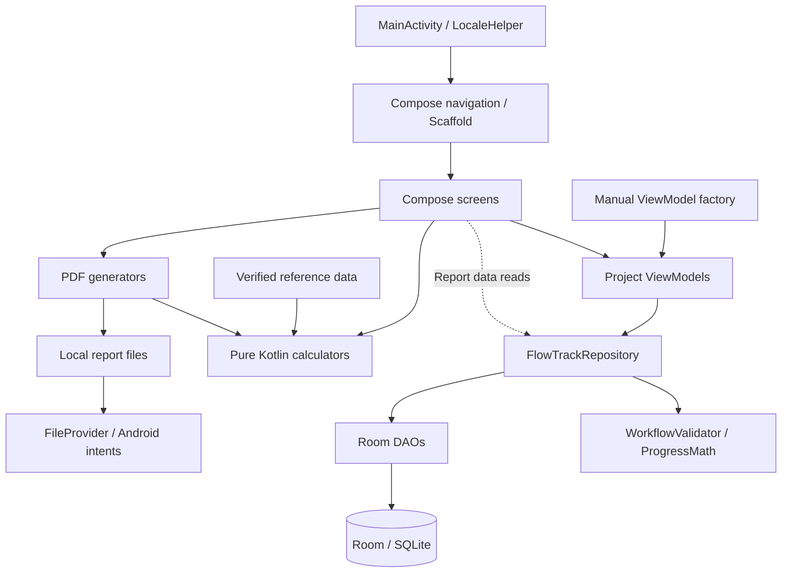

# PiCal

**حاسبات الأنابيب والهندسة الميكانيكية، ومتابعة أعمال الموقع، وتقارير PDF في تطبيق Android واحد.**

يساعد PiCal مهندس الموقع على حساب سماكات الضغط وكتلة الأنابيب ومراجعة الأكواع ومكونات أوعية الضغط، مع تنظيم المشاريع وتسجيل تقدم التنفيذ. تظهر المعادلة ومرجع الكود داخل الحاسبة، وتوضح علامات الاستفهام وحدات المدخلات ومكان الحصول على قيمها.

**الإصدار 1.1 · Android 7.0 فأحدث · Kotlin وJetpack Compose · العربية والإنجليزية**

[English](README.md) · [معمارية التطبيق](#معمارية-التطبيق) · [البناء والتشغيل](#البناء-والتشغيل) · [المراجع والنطاق](#المراجع-والنطاق)

## الميزات

| القسم | الوظائف |
|---|---|
| الحاسبات | سماكة الماسورة المستقيمة، كتلة الأنابيب، سماكة الأكواع، الانحناءات المايلة، ومكونات أوعية الضغط المدعومة. |
| شرح المدخلات | المعادلة وطبعة الكود والوحدات، وشروح مفصلة لمصادر S وE وW وY والسماحيات والأبعاد. |
| المشاريع والمناطق | رقم المشروع والمهندس المسؤول والعميل والمقاول، وتقسيم مناطق العمل والتبديل بين المشاريع. |
| سير العمل | تعريف المراحل وترتيبها بالسحب، مثل التجهيز واللحام والفحص والاختبار والتسليم. |
| إدخال التقدم | التاريخ والمهمة والمنطقة والقطر ووحدته وعدد الوصلات والمنفذ والمشرف، وساعات وصورة اختيارية. |
| الفريق والحضور | أدوار الفريق، وحاضر/متأخر/غائب، وتوقيت الدخول والخروج. |
| لوحة التحكم | كميات المرحلة النهائية، وعدد الوصلات، وإنتاج كل مرحلة، ونسبة الإكمال وتوزيع الأقطار والسجلات. |
| التقارير | تقدم المشروع، وإنتاجية اللحام، ونشاط الموظف، وتقارير مستقلة لكل حاسبة، مع فتح PDF ومشاركته. |
| اللغات والتعريف | واجهة عربية من اليمين إلى اليسار وواجهة إنجليزية، وشاشة حول التطبيق وزر التواصل عبر LinkedIn. |

تحفظ بيانات المشروع محليًا في Room. تعمل الحسابات وإنشاء التقارير على الجهاز؛ فتح LinkedIn أو المشاركة عبر تطبيق آخر يتبع اتصال التطبيق المختار.

## صور التطبيق

الصور التالية من واجهات PiCal الفعلية على Android 16. أسماء المشاريع والأشخاص والأرقام أمثلة وهمية من نسخة معاينة مستقلة عن بيانات المستخدم.

<table>
  <tr><th>لوحة تقدم المشروع</th><th>سير العمل</th><th>المعادلات والحاسبات</th></tr>
  <tr>
    <td></td>
    <td></td>
    <td></td>
  </tr>
  <tr><th>نتائج الانحناء المايل</th><th>تصدير PDF</th><th>حول التطبيق بالعربية</th></tr>
  <tr>
    <td></td>
    <td></td>
    <td></td>
  </tr>
</table>

<details>
<summary>صور إدخال التقدم والحضور</summary>

<table>
  <tr><th>إدخال التقدم</th><th>الحضور</th></tr>
  <tr>
    <td></td>
    <td></td>
  </tr>
</table>

</details>

## الحاسبات الهندسية

| الحاسبة | الأساس المنفذ | النتائج |
|---|---|---|
| الماسورة المستقيمة | B31.3-2018 أو B31.1-2022 حسب الاختيار | سماكة الضغط والسماحيات، وفحص الجدار المقاس، وفحص شراء السمك الاسمي بشكل مستقل. |
| كتلة الأنابيب | هندسة المقطع الحلقي والكثافة المدخلة | كجم/م، والكتلة الكلية، وكتلة الماء الاختيارية والمجموع. |
| الأكواع | B31.3-2018 الفقرة 304.2.1 | معاملات باطن وظهر الكوع والسماكات المطلوبة وفحص جدار الباطن المقاس. |
| الانحناءات المايلة | B31.3-2018 الفقرة 304.2.3، وB31.1-2022 الفقرة 104.2.3 | ضغط B31.3 المسموح ومعادلته الحاكمة ونصف القطر وامتداد الجدار؛ ومسار ضغط B31.1 وسمك المقطع الاختياري. |
| أوعية الضغط | قواعد مكونات BPVC VIII Division 1 المنفذة | سماكة الأسطوانة والرؤوس الإهليلجية والتوريسفيرية ونصف الكروية والمخروطية، وفحص MAWP الاختياري. |

### المادة والحرارة والمدخلات

- الحرارة الافتراضية **20°C** قابلة للتعديل، ويجب إدخال حرارة معدن التصميم الفعلية.
- قائمة المادة تحدد هوية المادة وشكل المنتج، ولا تثبت ملاءمتها للخدمة.
- **لا يُستنتج الإجهاد المسموح S من الخضوع أو الشد عند حرارة الغرفة.** الملء التلقائي محدود بصفوف A106 بدون لحام درجات A/B/C الموثقة بصريًا في B31.1-2022 Table A-1، من 20°C حتى عمود 800°F المرفق.
- يختار المرجع الآلي أول عمود حرارة مطبوع يغطي الحرارة المدخلة ويذكره، دون استيفاء أو تمديد خارج البيانات الموثقة. بقية المواد والأكواد والحرارات تحتاج S يدويًا.
- تغيير المادة أو الحرارة يبطل معاملات الحالة السابقة. يجب مراجعة معاملات الجودة واللحام والتفاوت والملاحظات للمنتج الفعلي.
- جدول B36.10-2022 المدمج للأبعاد والسماكات محدود؛ تتاح أبعاد مخصصة بالملليمتر أو البوصة.
- يدعم تحليل المدخلات الأرقام العربية واللاتينية، مع تحويل الوحدات ورفض القيم غير المحدودة والهندسة خارج النطاق.

### المعادلات والتقارير

```text
B31.3-2018, 304.1.1 / 304.1.2, (2), (3a)
t  = P D / [2 (S E W + P Y)]
tm = t + c

B31.1-2022, 104.1.2(a), (7)
tm = P Do / [2 (S E W + P y)] + A

كتلة الماسورة لكل متر
m/L = π t (D − t) ρ / 1,000,000
```

تستخدم معادلات الضغط MPa للضغط والإجهاد، وmm للأبعاد والسماحيات. يحول ضغط الإدخال من bar إلى MPa بضربه في 0.1. معادلة الكتلة تستخدم D وt بالملليمتر والكثافة بكجم/م³ وتنتج كجم/م. تقدير الماء يفترض ملء التجويف بالكامل بكثافة 1000 كجم/م³.

يتشارك عرض الحاسبة وتقريرها نص المعادلة من [EngineeringEquations.kt](app/src/main/java/com/ahmedismail/flowtrack/util/EngineeringEquations.kt). تعيد مولدات تقارير الحاسبات الحساب من المدخلات، وتعرض المعادلات والمراجع والنتائج وحدود الاستخدام. فحص الجدار بعد التصنيع مستقل عن فحص السمك الاسمي المطلوب للشراء.

## طريقة متابعة المشروع

1. أنشئ المشروع وعرّف المهندس والعميل والمقاول.
2. أضف المناطق والفريق ومراحل التنفيذ بالترتيب المطلوب.
3. سجّل إنتاج كل مرحلة حسب المنطقة والقطر وعدد الوصلات والأشخاص.
4. راجع كميات المراحل والمرحلة النهائية في لوحة التحكم.
5. اختر فترة التقرير وصدّر ملف PDF المناسب.

يتحقق `WorkflowValidator` من كميات الوصلات التراكمية حسب المشروع والمنطقة والقطر الفعلي. لا تتجاوز مرحلة لاحقة الكمية المتاحة في المرحلة السابقة. يشمل التحقق تعديل السجلات وحذفها وإعادة ترتيب مراحل سير العمل.

```text
القطر-بوصة = القطر بالبوصة × عدد الوصلات
نسبة الإكمال = قطر-بوصة المرحلة النهائية / قطر-بوصة أول مرحلة مسجلة
```

تعتمد مؤشرات **الإكمال** على آخر مرحلة معرفة في المشروع. لا تجمع كميات المراحل لأن الوصلات نفسها تسجل في عدة مراحل. نسبة الإكمال تخص الإنتاج المسجل من أول مرحلة إلى الأخيرة، وليست مقارنة بنطاق مخطط مستقل مدخل مسبقًا.

يقتصر تقرير إنتاجية اللحام على المهام من نوع اللحام. يعرض تقرير الموظف نشاط الشخص المحدد وساعاته الاختيارية وحضوره في الفترة المختارة.

## معمارية التطبيق

تطبيق Android أصلي من وحدة واحدة. تستخدم متابعة المشاريع نمط MVVM، ومستودعًا على مستوى Application يحقن يدويًا، وKotlin Flow وRoom. تستدعي شاشات الحاسبات محركات Kotlin مباشرة؛ تنسق شاشات التقارير إنشاء PDF، وبعضها يقرأ تدفقات المستودع مباشرة.


<details>
<summary>مصدر الرسم بصيغة Mermaid</summary>



</details>

| الطبقة | المسؤولية | المصدر |
|---|---|---|
| التطبيق والتنقل | الاعتمادات والمشروع الحالي والمسارات واللغة والرأس والتذييل | `FlowTrackApplication.kt` و`MainActivity.kt` و`ui/nav/` |
| العرض | شاشات Compose وحالة الحقول والشروح وإجراءات ViewModels | `ui/screens/` و`viewmodel/` |
| المستودع | عمليات المشاريع والفريق وسير العمل والحضور وحفظ التقدم بمعاملات | `data/repository/FlowTrackRepository.kt` |
| القواعد والحسابات | تحقق المراحل وتجميع التقدم والوحدات والمدخلات ومحركات الحساب | `util/` |
| التخزين | الكيانات والمفاتيح والفهارس والاستعلامات والتحويلات وترحيل المخطط | `data/entity/` و`data/dao/` و`data/AppDatabase.kt` |
| البيانات المرجعية | أبعاد الأنابيب وهوية المواد ومعاملات الكود ومجموعة S الموثقة | `data/reference/` |
| التقارير | رسم PdfDocument والمراجع والملفات والإشعارات والمشاركة | `pdf/` |

مخطط Room الحالي **الإصدار 6**، مع ترحيلات صريحة من الإصدارات 1 إلى 6. المشروع يرتبط بالمناطق والمهام والفريق وسجلات التقدم والحضور. سجل التقدم يرتبط بمهمة ومنطقة، وبمنفذ ومشرف اختياريين. للحضور فهرس فريد لكل عضو وتاريخ. يوجد رسم علاقات الكيانات التفصيلي في [النسخة الإنجليزية](README.md#data-model).

ظل معرّف التطبيق `com.ahmedismail.flowtrack` واسم قاعدة البيانات `flowtrack.db` كما هما لتوافق تحديث PiCal مع البيانات السابقة.

### تنظيم المصدر

```text
app/src/main/java/com/ahmedismail/flowtrack/
├── data/       الكيانات وDAOs والمستودع والمراجع
├── pdf/        مولدات تقارير المشروع والحاسبات
├── ui/         الشاشات والمكونات والتنقل والثيم
├── util/       محركات الحساب وقواعد التحقق
└── viewmodel/  حالة المشروع وإجراءاته
app/src/main/res/          موارد العربية والإنجليزية والخطوط والأيقونات
app/src/test/              اختبارات JVM
app/schemas/               مخططات Room
docs/images/               الغلاف والصور الفعلية
tools/readme-preview/      معاينة صور معزولة ببيانات وهمية
tools/report-preview/      أداة فحص PDF الاختيارية
```

## البناء والتشغيل

يلزم Android Studio يدعم Android Gradle Plugin المستخدم، وJDK **17**، ومنصة SDK **34**، وهاتف أو محاكي على API **24 فأحدث**. جرى التحقق أيضًا باستخدام JBR 21. تحتاج أول مزامنة إلى تنزيل الاعتمادات؛ يتطلب البناء دون اتصال ذاكرة Gradle مكتملة.

| المكوّن | الإعداد الحالي |
|---|---|
| AGP / Gradle | 8.5.2 / 8.7 |
| Kotlin / KSP | 1.9.24 / 1.9.24-1.0.20 |
| Compose BOM / Compiler | 2024.06.00 / 1.5.14 |
| Room / Navigation Compose | 2.6.1 / 2.7.7 |
| minimum / target / compile SDK | 24 / 34 / 34 |
| إصدار التطبيق | 1.1، رقم البناء 2 |

افتح جذر المشروع في Android Studio، ثم مزامنة Gradle وتشغيل `app`. اسم المجلد والمشروع الداخلي التاريخي FlowTrack، والاسم الظاهر PiCal.

**Windows / PowerShell**

```powershell
.\gradlew.bat :app:assembleDebug
.\gradlew.bat :app:testDebugUnitTest :app:lintDebug
```

**macOS / Linux**

```bash
bash ./gradlew :app:assembleDebug
bash ./gradlew :app:testDebugUnitTest :app:lintDebug
```

ملف البناء: `app/build/outputs/apk/debug/app-debug.apk`. توجد نسخة التطوير المسماة [PiCal-1.1-debug.apk](output/apk/PiCal-1.1-debug.apk). هي نسخة Debug وليست توزيع إنتاج موقعًا للنشر.

```bash
adb install -r app/build/outputs/apk/debug/app-debug.apk
```

تكتب التقارير في مجلد `reports` داخل مساحة external-files الخاصة بالتطبيق، وتشارك عبر `FileProvider`. تحفظ المشاريع في Room بمساحة التطبيق الخاصة. احتفظ بنسخ من التقارير المهمة قبل إزالة التطبيق.

## التحقق

لقطة التحقق الموثقة بتاريخ **6 أكتوبر 2026**:

- 93 اختبار وحدة JVM دون فشل في النسخة المتحقق منها.
- بناء Debug ناجح وLint دون أخطاء؛ تبقى تحذيرات غير مانعة.
- اختبار اللغتين والشروح وشاشة التعريف وزر LinkedIn على الهاتف.
- 13 عينة PDF للحاسبات مولدة على Android، مع فحص المعادلات والاسم والأرقام وتقسيم الصفحات.

تغطي الاختبارات الحسابات والهندسة المدعومة والمدخلات والوحدات واعتماديات المراحل وتجميع التقدم وجداول المعاملات وحدود الإجهاد الموثق. نجاحها يخص الحالات المنفذة ولا يعد اعتمادًا كاملًا لتصميم الأنابيب أو الأوعية.

<details>
<summary>مثال تقرير حسابي</summary>


[فتح المثال PDF](docs/examples/miter-calculation.pdf). المدخلات والمعاملات توضيحية وليست اعتماد مادة لمشروع فعلي.

</details>

[إعادة تصوير الواجهات](tools/readme-preview/README.md) · [أداة فحص PDF](tools/report-preview/README.md). الأداتان خارج البناء العادي للتطبيق.

## المراجع والنطاق

| المرجع | الاستخدام |
|---|---|
| ASME B31.3-2018 | قواعد الماسورة المستقيمة والأكواع والمايل المنفذة وإرشادات المعاملات. |
| ASME B31.1-2022 | معادلة الماسورة ومسارات ضغط المايل وسمك المقاطع ومجموعة A106 الموثقة. |
| ASME B36.10-2022 | مجموعة الأقطار الخارجية وسماكات Schedule الاسمية المتاحة. |
| BPVC VIII Division 1 / Section II-D | قواعد الوعاء المنفذة وإرشاد S اليدوي؛ لا تثبت المقتطفات المتاحة طبعة BPVC مستقلة. |

راجع الكود والطبعة وصف المادة وشكل المنتج وعمود الحرارة والملاحظات للتطبيق الحقيقي. لا تنقل قيم S من B31.1 إلى B31.3 أو الوعاء. يبين التطبيق حالات المايل التي تتطلب التأهيل وفق **104.7**؛ حساب سمك المقطع لا يحل محل هذا التأهيل.

النطاق الحالي هو قواعد الضغط الداخلي والهندسة المنفذة. التصميم الكامل للضغط الخارجي وتقوية الفروع والفتحات والتعب والعمر المتبقي والتأهيل الكامل خارج هذا النطاق. تصدير Excel وقاعدة إجهاد مرخصة عامة للمواد غير منفذين.

مراجع تفصيلية: [المعادلات والمصادر](PIPING_SOURCES_AR.md) · [شروح الحاسبات](CALCULATOR_GUIDANCE_REVIEW_AR.md) · [هوية PiCal](PICAL_BRANDING_REVIEW_AR.md).

توجد إشعارات الخطوط في [app/src/main/assets/font_licenses](app/src/main/assets/font_licenses/). تعريف المراجع لا يغني عن النصوص الكاملة للأكواد ومستندات التصميم المعتمدة.

## المطور والتواصل

**Ahmed Ismail Soliman** · [LinkedIn](https://www.linkedin.com/in/ahmed-ismail-soliman)

نفس الرابط متاح من **حول PiCal ← تواصل عبر LinkedIn** داخل التطبيق.
