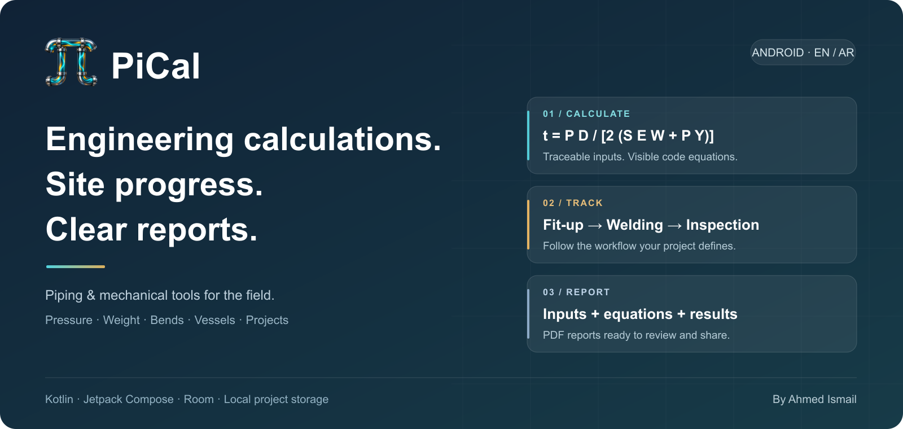

# PiCal

**Piping and mechanical calculations, field progress tracking, and PDF reporting in one native Android app.**

PiCal helps engineers calculate pressure wall requirements, review pipe and vessel geometry, follow project workflows, and prepare readable reports. Equations and code references appear alongside calculator inputs, with field help explaining units and where to obtain each value.

**Version 1.1 · Android 7.0+ · Kotlin + Jetpack Compose · English / العربية**

[العربية](README.ar.md) · [Features](#features) · [Screenshots](#screenshots) · [Architecture](#architecture) · [Build](#build-and-run) · [References](#calculation-references-and-scope) · [Contact](#author-and-contact)

## Features

| Area | What you can do |
|---|---|
| Engineering calculators | Calculate straight-pipe pressure wall, pipe mass, pipe-bend wall, miter bends, and supported pressure-vessel components. |
| Input guidance | Read the governing equation, code edition, units, and detailed help. Select common materials or identify a custom product. |
| Projects and areas | Create projects with project numbers, responsible engineers, clients, contractors, and work areas. Switch between projects. |
| Custom workflows | Define and reorder stages such as fit-up, welding, inspection, testing, and handover. Stage order is project-specific. |
| Progress entries | Record date, task, area, diameter, units, joint quantity, performer, supervisor, optional hours, and a photo attachment. |
| Team and attendance | Manage team roles, record present/late/absent status, and enter check-in/check-out times. |
| Project dashboard | View completed diameter-inches, completed joints, stage totals, completion ratio, diameter breakdowns, and recorded entries. |
| PDF reporting | Export project progress, welding productivity, employee activity, and independent calculator reports. Open or share generated PDFs. |
| Bilingual interface | Switch between English and Arabic, including right-to-left layout and localized field guidance. |
| About and contact | View application version, reference information, and the developer's LinkedIn contact link. |

Project records live in a local Room database. Calculations and PDF generation run on the device; opening LinkedIn or sharing through another application uses that application's connectivity.

## Screenshots

These are real PiCal screens captured on Android 16. Project names, people, quantities, and calculator inputs are fictional documentation examples from an isolated preview installation.

<table>
  <tr><th>Project dashboard</th><th>Custom workflow</th><th>Calculator equations</th></tr>
  <tr>
    <td>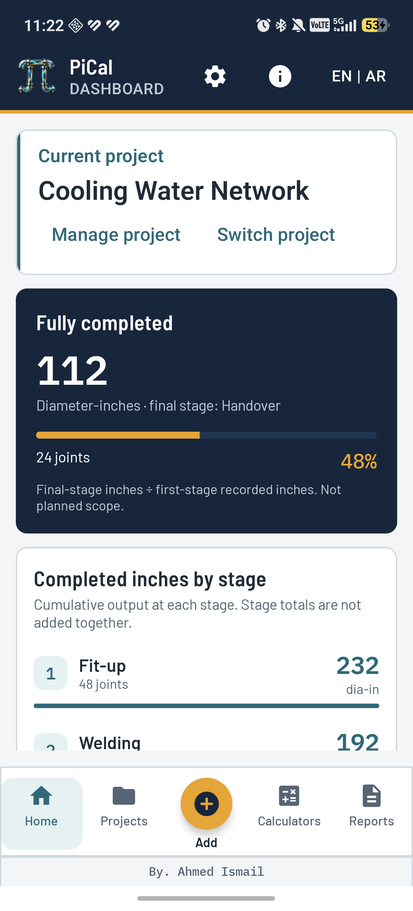</td>
    <td>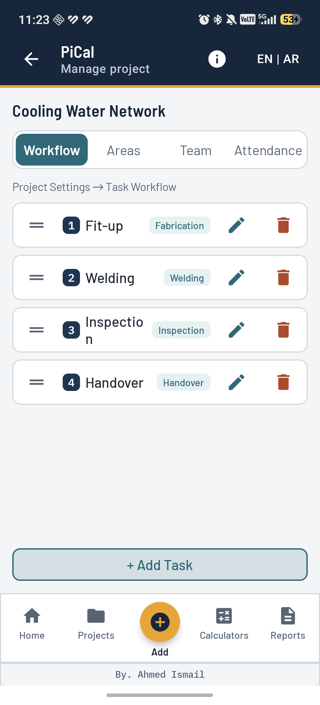</td>
    <td>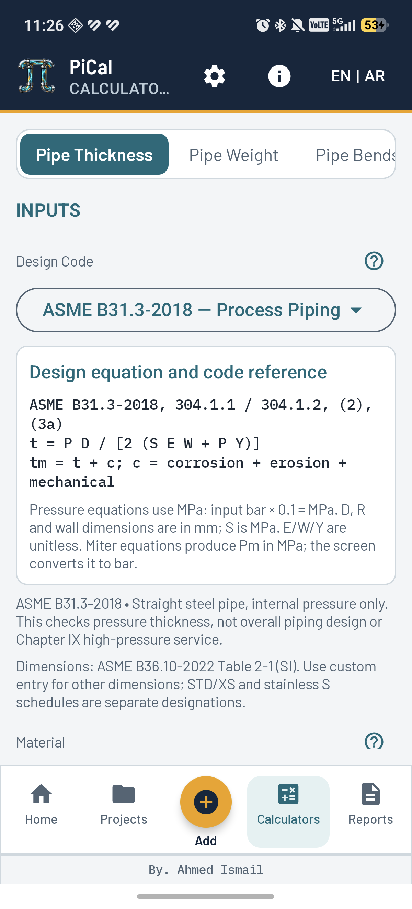</td>
  </tr>
  <tr><th>Miter results</th><th>PDF exports</th><th>Arabic interface and About</th></tr>
  <tr>
    <td>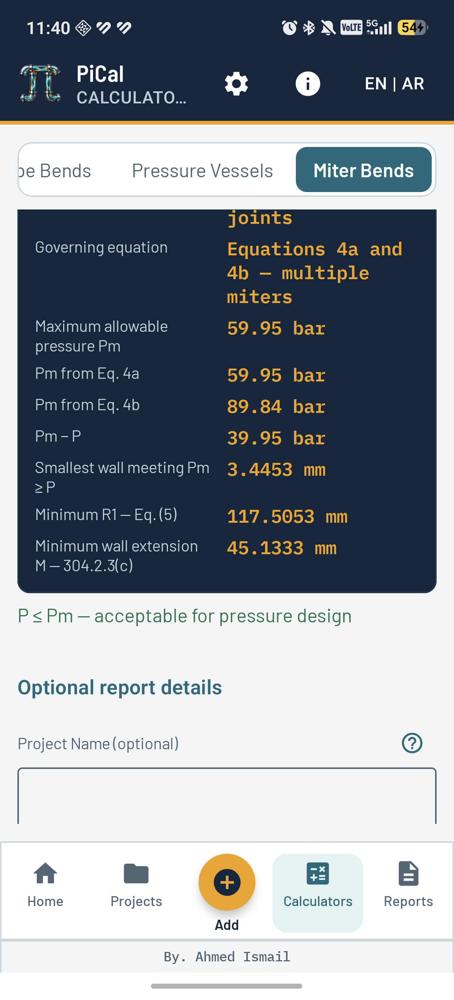</td>
    <td>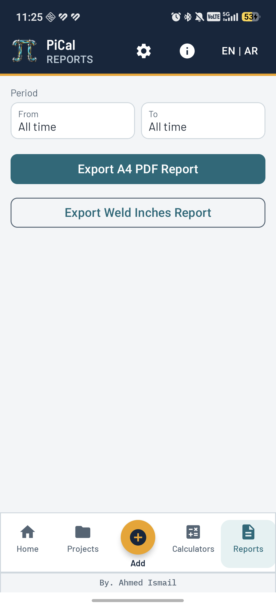</td>
    <td>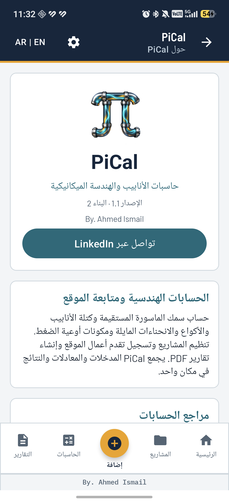</td>
  </tr>
</table>

<details>
<summary>Progress entry and attendance screens</summary>

<table>
  <tr><th>Record progress</th><th>Team attendance</th></tr>
  <tr>
    <td>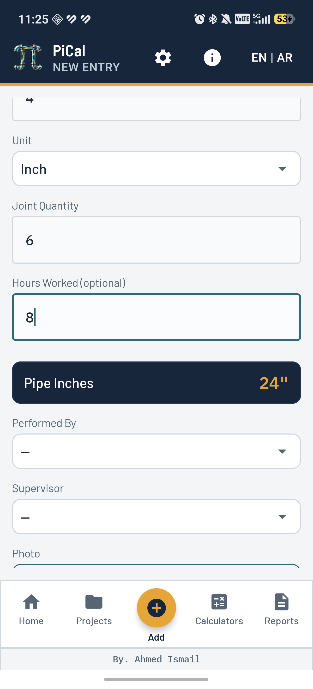</td>
    <td>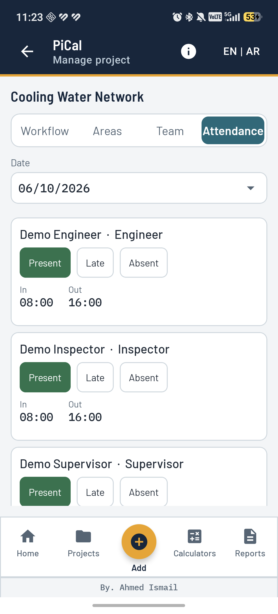</td>
  </tr>
</table>

</details>

## Engineering calculators

| Calculator | Implemented basis | Main results |
|---|---|---|
| Straight pipe | B31.3-2018 or B31.1-2022, selected in the calculator | Pressure wall, allowances, finished-wall comparison, and a separate nominal ordering check. |
| Pipe weight | Annular geometry and entered material density | Bare-pipe mass per metre, total pipe mass, optional water-fill mass, and combined mass. |
| Pipe bends | B31.3-2018, 304.2.1 | Intrados/extrados factors and wall requirements; optional measured intrados-wall comparison. |
| Miter bends | B31.3-2018, 304.2.3; B31.1-2022, 104.2.3 | B31.3 allowable pressure, governing equation, required radius and wall extension; B31.1 pressure path and optional segment wall. |
| Pressure vessels | Implemented BPVC VIII Division 1 component rules | Pressure and ordering thickness for cylindrical, ellipsoidal, torispherical, hemispherical, and conical components; optional MAWP check. |

### Inputs and material data

- Design temperature starts at **20°C** and remains editable. Enter the actual design metal temperature for the application.
- Material dropdowns identify the material/product; they do not establish suitability for the service.
- **Allowable stress S is not calculated from room-temperature yield or tensile strength.** Automatic values are limited to visually verified **B31.1-2022 Table A-1 A106 seamless grades A/B/C**, from 20°C through the supplied 800°F column.
- The verified stress lookup selects the next printed temperature column covering the entered temperature, without interpolation or extrapolation, and shows that column. Other codes, products, and temperatures require manual S.
- A material or temperature change invalidates the previous case's coefficients. Quality factors, weld factors, table notes, and manufacturing tolerance must match the actual product.
- The **B36.10-2022** size/schedule table is a limited subset. Custom diameter and wall entries support mm/inch conversion.
- Numeric parsing accepts Latin and Arabic digits. Calculations validate finite inputs and supported geometry.

### Equations and calculator reports

```text
B31.3-2018, 304.1.1 / 304.1.2, (2), (3a)
t  = P D / [2 (S E W + P Y)]
tm = t + c

B31.1-2022, 104.1.2(a), (7)
tm = P Do / [2 (S E W + P y)] + A

Bare-pipe mass per metre
m/L = π t (D − t) ρ / 1,000,000
```

Pressure equations use **MPa** for P/S and **mm** for dimensions/allowances. Input pressure in bar is multiplied by 0.1 before calculation. The mass equation uses D/t in mm and density in kg/m³, producing kg/m. The optional water estimate assumes a full bore and density of 1000 kg/m³.

[EngineeringEquations.kt](app/src/main/java/com/ahmedismail/flowtrack/util/EngineeringEquations.kt) supplies shared equation text for the calculator and PDF. Calculator report generators recalculate from raw inputs and present inputs, equations, references, results, and scope notes. Finished-wall inspection and nominal purchasing checks are distinct evaluations.

## Project workflow and progress

1. Create a project and identify its responsible engineer, client, and contractor.
2. Configure areas and the team, then define the ordered workflow.
3. Record each stage's work with diameter, joint quantity, area, and people involved.
4. Review cumulative stage output on the dashboard.
5. Select a reporting period and export the relevant PDF.

`WorkflowValidator` checks cumulative joints by project, area, and physical diameter. A downstream stage cannot exceed the available upstream quantity. Edits, entry deletions, and workflow reordering are also checked against affected dependencies.

```text
diameter-inches = diameter in inches × joint quantity
completion ratio = final-stage diameter-inches / first-stage recorded diameter-inches
```

The dashboard's **completed** metrics use the final configured stage. Stage totals are not added together: the same joints may be recorded at several stages. The completion ratio measures recorded first-to-final-stage output, not an independently entered planned scope.

Welding productivity uses welding-type tasks only. Employee reports summarize the selected person's recorded activity and optional hours, with attendance for the selected period.

## Architecture

PiCal is a **single-module native Android application**. Project workflows use MVVM, a manually supplied application-scoped repository, Kotlin Flow, and Room. Calculator composables call pure Kotlin calculation objects directly; report screens coordinate PDF exports and, in some paths, read repository flows directly.

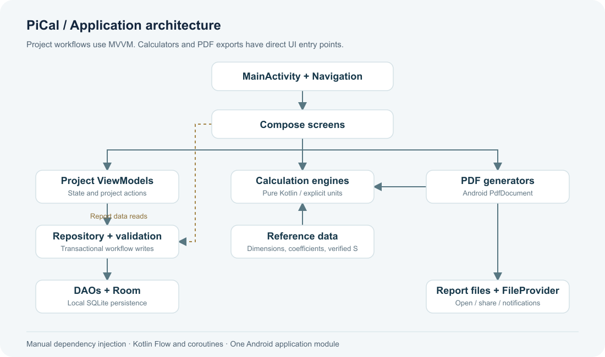

<details>
<summary>Editable Mermaid architecture</summary>

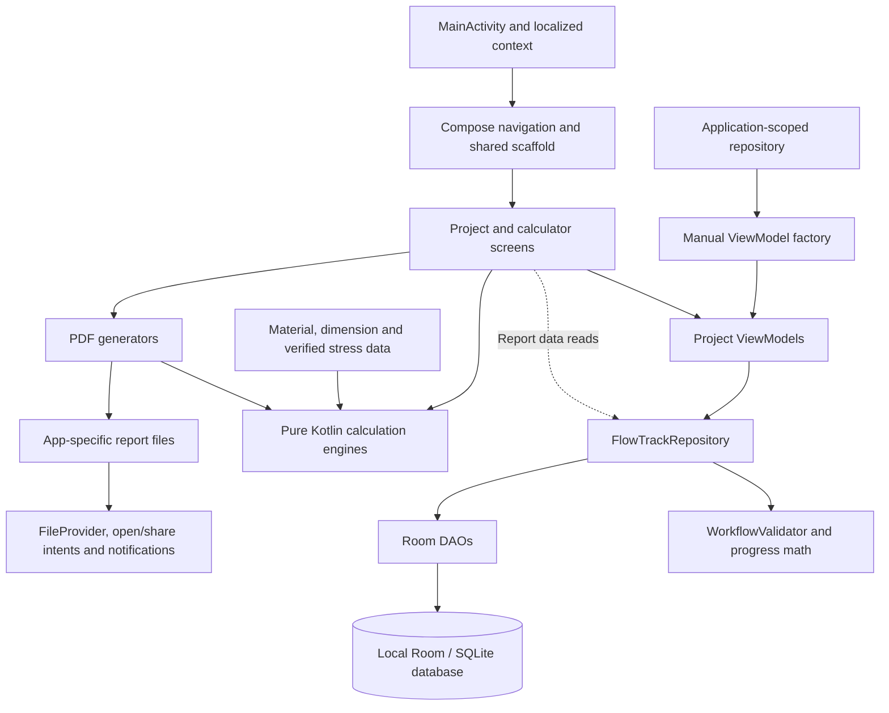

</details>

| Layer | Responsibilities | Source |
|---|---|---|
| Application / navigation | Dependencies, current project, routes, scaffold, language context | `FlowTrackApplication.kt`, `MainActivity.kt`, `ui/nav/`, `ui/components/` |
| Presentation | Compose screens, field state, guidance, user actions, project ViewModels | `ui/screens/`, `viewmodel/` |
| Repository | Project/team/workflow operations, transactional progress writes, attendance | `data/repository/FlowTrackRepository.kt` |
| Rules / calculations | Workflow constraints, stage summaries, units, input parsing, pressure and weight engines | `util/` |
| Persistence | Entities, foreign keys, indexes, DAOs, type converters, schema migrations | `data/entity/`, `data/dao/`, `data/AppDatabase.kt` |
| Reference data | Pipe dimensions/material identities, coefficient tables, verified stress subset | `data/reference/` |
| Reporting | Android PdfDocument rendering, equations, files, notifications, sharing URIs | `pdf/` |

### Data model

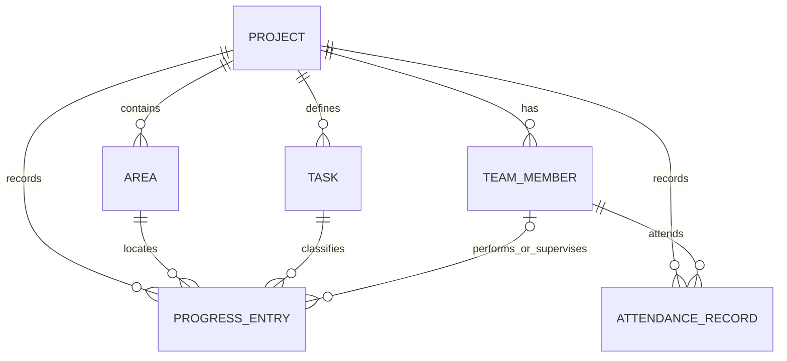

The Room schema is **version 6**, with explicit migrations from versions 1 through 6 and a unique member/date attendance index. The package remains `com.ahmedismail.flowtrack`, and the database remains `flowtrack.db`, preserving upgrade compatibility after the PiCal rebrand.

### Source layout

```text
app/
├── schemas/                         Room schema snapshots
├── src/main/
│   ├── java/com/ahmedismail/flowtrack/
│   │   ├── data/                    Entities, DAOs, repository, references
│   │   ├── pdf/                     Project and calculator PDF generators
│   │   ├── ui/                      Compose screens, navigation, theme
│   │   ├── util/                    Calculation engines and validation
│   │   └── viewmodel/               Project state and actions
│   └── res/                         EN/AR text, fonts, launcher assets
└── src/test/                        JVM unit tests
assets/branding/                     PiCal source artwork
docs/images/                         Cover and real screenshots
tools/readme-preview/                Isolated fictional screenshot fixture
tools/report-preview/                Opt-in Android PDF QA harness
```

## Build and run

Use Android Studio compatible with this project's Android Gradle Plugin, JDK **17**, Android SDK **Platform 34**, and an emulator/device on **API 24+**. The development build has also been validated with JBR 21. First-time dependency downloads need network access; offline builds need a populated Gradle cache.

| Component | Repository configuration |
|---|---|
| Android Gradle Plugin / Gradle wrapper | 8.5.2 / 8.7 |
| Kotlin / KSP | 1.9.24 / 1.9.24-1.0.20 |
| Compose BOM / compiler | 2024.06.00 / 1.5.14 |
| Room / Navigation Compose | 2.6.1 / 2.7.7 |
| Minimum / target / compile SDK | 24 / 34 / 34 |
| App version | 1.1, version code 2 |

Open the repository root in Android Studio, sync Gradle, and run `app`. The historical folder/build-project name is FlowTrack; the visible application is PiCal.

**Windows / PowerShell**

```powershell
.\gradlew.bat :app:assembleDebug
.\gradlew.bat :app:testDebugUnitTest :app:lintDebug
```

**macOS / Linux**

```bash
bash ./gradlew :app:assembleDebug
bash ./gradlew :app:testDebugUnitTest :app:lintDebug
```

Output: `app/build/outputs/apk/debug/app-debug.apk`. A named copy of the validated development build is available locally at [PiCal-1.1-debug.apk](output/apk/PiCal-1.1-debug.apk). This is a debug APK, not a signed production distribution.

```bash
adb install -r app/build/outputs/apk/debug/app-debug.apk
```

PDFs are written to the app's external-files `reports` directory and shared through `FileProvider`. Project records are stored in app-private Room storage. Save copies of important reports before uninstalling.

## Validation

The documented validation snapshot is **6 October 2026**:

- **93 JVM unit tests**, with no failures in the validated build.
- Successful debug assembly and Android Lint with **zero errors**; non-blocking warnings remain.
- Real-device checks of English/Arabic layouts, input guidance, About, and LinkedIn contact.
- **13 calculator PDF fixtures** generated on Android and checked for equations, branding, values, and pagination.

Tests cover calculations, supported geometry, numeric inputs, workflow dependencies, stage summaries, coefficient data, and verified stress lookup boundaries. They validate the implemented cases, not a complete piping or vessel design.

<details>
<summary>Sample calculation report</summary>

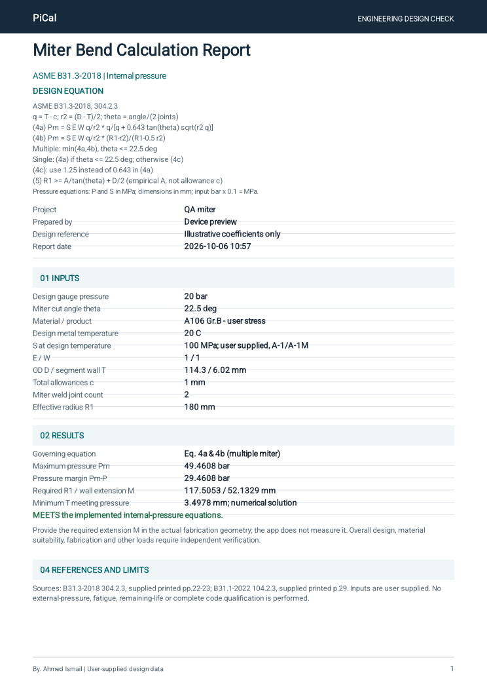

[Open the illustrative PDF](docs/examples/miter-calculation.pdf). Its coefficients and geometry are synthetic examples, not a project material approval.

</details>

[Documentation screenshot instructions](tools/readme-preview/README.md) · [Device PDF QA harness](tools/report-preview/README.md)

These tools are excluded from normal app builds.

## Calculation references and scope

| Reference | Use in PiCal |
|---|---|
| ASME B31.3-2018 | Implemented process-piping straight-wall, bend, and miter rules and coefficient guidance. |
| ASME B31.1-2022 | Implemented power-piping straight-wall equation, miter paths, segment walls, and verified A106 stress subset. |
| ASME B36.10-2022 | Bundled subset of nominal outside diameters and schedule walls. |
| BPVC VIII Division 1 / Section II-D | Implemented vessel equations and manual stress guidance; the supplied excerpts do not independently establish a BPVC edition. |

Use the exact code, edition, material/product row, temperature column, and applicable notes for the actual design. B31.1 stress values are not transferred to B31.3 or vessels. Miter cases needing **B31.1 104.7 qualification** are identified; a segment-wall result does not replace that qualification.

The application covers its implemented internal-pressure and geometry rules. Full external-pressure design, branch/opening reinforcement, complete fatigue assessment, remaining-life prediction, and complete code qualification are outside the current scope. Excel export and a general licensed material-stress database are not implemented.

Detailed reviews: [Piping equations and references](PIPING_SOURCES_AR.md) · [Calculator guidance](CALCULATOR_GUIDANCE_REVIEW_AR.md) · [PiCal branding](PICAL_BRANDING_REVIEW_AR.md)

Bundled font notices are in [app/src/main/assets/font_licenses](app/src/main/assets/font_licenses/). Engineering references do not replace the full standards and project design documents.

## Author and contact

**Ahmed Ismail Soliman** · [LinkedIn](https://www.linkedin.com/in/ahmed-ismail-soliman)

The same link is available through **About PiCal → Connect on LinkedIn** in the application.
